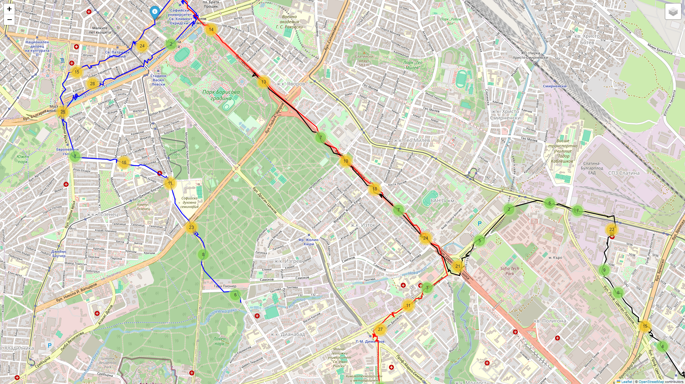

# 🚦 Real-Time GPS Data Smoothing Pipeline

Welcome! This repository contains a completed streaming pipeline that reads, cleans, and smooths raw GPS data using Kafka, Go, Python, and OSRM.

---

## ✅ Project Summary

This pipeline simulates a real-time GPS data stream, applies data cleaning and smoothing using OSRM, and outputs both raw and improved data for analysis and visualization.

---

## 🛠️ Technologies Used

- **Python** – Data ingestion script
- **Go** – Concurrent stream processing with batching
- **Kafka** – Messaging backbone
- **OSRM** – Road snapping and routing
- **Docker Compose** – Containerized OSRM and Kafka
- **Folium** – Data visualization

---

## 🔁 Pipeline Breakdown

### 1. 📥 Data Ingestion

- Written in **Python**
- Reads raw GPS data from CSV
- Produces messages concurrently per vehicle to a Kafka topic - ```raw_gps_data``` - with a random 0–2s interval

### 2. 🔄 Data Processing

- Written in **Go**
- Three concurrent service instances consume GPS data from Kafka (each one from a vehicle)
- GPS records processed in batches (10–15 items)
- Smoothing applied via:
  - **Imputation** (filling missing data fields with known data from previous records, completing missing data)
  - **Projection** (snapping coordinates to roads with OSRM)
- Smoothed output is published to another Kafka topic - ```processed_gps_data```

> ⚠️ While the full data transformation pipeline isn't complete, the imputation strategy has been reviewed and outlined for future improvements.

### 3. Writing to file
- Written in **Python**
- Reads processed GPS records from ```processed_gps_data``` and writes them to ```processed_gps_data.csv```

### 4. 🗺️ Visualisation

- Using **Folium** written in **Python**
- Creates two interactive maps - one with the raw data, one with the processed data.

The difference between raw and smoothed GPS data is shown below:

**Before Smoothing**  


**After Smoothing**  

As you can see, there is yet room for improvement

---

## 🚧 Future Improvements

- Finalize imputation logic
- Optimize GPS Coordinate smoothing logic
- Combine the execution steps into a single script instead of having to run each and every file
- Add persistent storage
- Build a lightweight frontend for live GPS path tracking

---

## 🤖 Notes on AI Use

AI tools, including but not limited to ChatGPT, Claude, Deepseek were used as coding assistants to speed up development. All code was understood, reviewed, and adapted to fit the specific task and data.

---

Thanks for checking this out!


# Setup:

## 1. Boot up Kafka


Open the ```kafka``` directory and run

```docker compose up -d```

### Some useful Kafka debudding commands I made use of
Enter Kafka container through docker

```docker exec -it kafka-kafka-1 bash```

List currently living topics:

```kafka-topics --list --bootstrap-server localhost:9092```

You can view the contents of currently active topics with:

```kafka-console-consumer --bootstrap-server localhost:9092 --topic {topic-name} --from-beginning```

or check the status of its partitioning with:

```kafka-topics --describe --topic {topic-name} --bootstrap-server localhost:9092```

In case you need to clear a kafka topic:

```kafka-topics --delete --bootstrap-server localhost:9092 --topic {topic-name}```


## 2. Begin producing from raw_gps.csv

Create a venv and install dependencies

```python3 -m venv venv && source venv/bin/activate && pip install kafka-python pandas folium```

Navigate to ```producer``` & run the script:

```python3 producer.py```

## 3. Smooth and impute data with Go & OSRM
Navigate to  ```OSRM-processing``` directory and run:

Build & run OSRM:

- docker compose -f ./osrm.yml --profile init up --build
- docker compose -f ./osrm.yml --profile app up --build

```go run client.go```

## 4. Output processed data to file 
Navigate to ```consumers``` and fire up the script:

``python3 output.py``

## 5. Visualise the data
Run the visualiser to create two maps - one routing the raw data, and one routing the processed data.

```python3 visualiser.py```
 
This will create a directory, ```maps```, containing 
```raw_gps_data_map.html``` and ```processed_gps_data_map.html```


